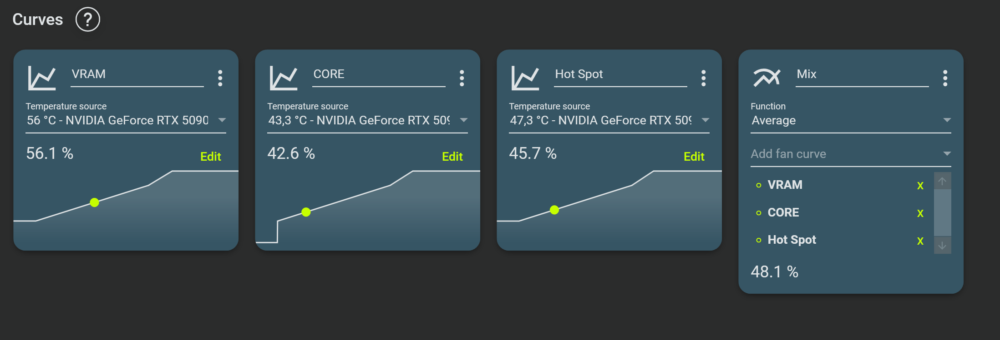
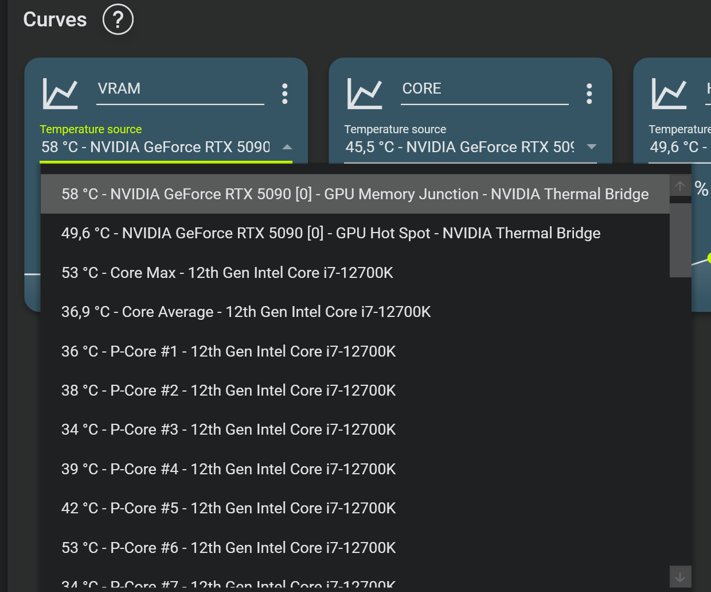

# FanControl.NvidiaThermals

English | [Español](#spanish)

| Contents | Índice |
| --- | --- |
| [English](#english) | [Español](#spanish) |
| [Why this exists](#why-this-exists) | [Por qué existe](#por-qué-existe) |
| [Current status](#current-status) | [Estado actual](#estado-actual) |
| [Compatibility](#compatibility) | [Compatibilidad](#compatibilidad) |
| [Requirements](#requirements) | [Requisitos](#requisitos) |
| [Installation](#installation) | [Instalación](#instalación) |
| [Diagnostics](#diagnostics) | [Diagnóstico](#diagnóstico) |
| [Repository layout](#repository-layout) | [Estructura del repositorio](#estructura-del-repositorio) |
| [Legal note](#legal-note) | [Nota legal](#nota-legal) |
| [License](#license) | [Licencia](#licencia) |

`FanControl.NvidiaThermals` is a FanControl plugin for NVIDIA GPUs that exposes:

- `GPU Core`
- `GPU Memory Junction`
- `GPU Hot Spot`

The project exists to provide these temperatures directly inside FanControl without depending on GPU-Z, HWMonitor or other monitoring tools running permanently in the background.

On NVIDIA RTX 50 GPUs, NVIDIA effectively removed normal access to the `GPU Hot Spot` metric. Mainstream monitoring tools could no longer expose it through their usual paths, and the solutions that appeared afterwards came from community efforts rather than from an officially stable interface.

This plugin is designed to restore reliable access to `GPU Hot Spot` together with `GPU Core` and `GPU Memory Junction`, so FanControl can build GPU cooling curves from the hottest point of the card, either as a single control metric or combined with other temperatures.

  

  Mixed GPU fan curve built from VRAM, Core and Hot Spot sensors.

  

  Sensor selection inside FanControl, showing NVIDIA Thermal Bridge readings exposed by the plugin.

## English

### Why this exists

With the RTX 50 generation, NVIDIA effectively removed normal access to the `GPU Hot Spot` metric. Tools such as GPU-Z, HWMonitor or HWiNFO could no longer expose it through the usual public path, so integrating it cleanly into FanControl stopped being straightforward.

Community workarounds appeared, including `FanControl.NvThermalSensors`, but they either depended on additional software staying open in Windows or eventually broke again after successive NVIDIA driver updates.

That matters because `GPU Hot Spot` is an important control signal: it lets you modulate GPU cooling from the highest thermal point on the card, either as the only reference or in combination with `GPU Core` and `GPU Memory Junction`, which gives much more reliable control over GPU cooling behaviour.

On RTX 50 GPUs, the Hot Spot value can still be read reliably through a signed PawnIO module, while Core and Memory Junction remain available through NVAPI.

This plugin combines both paths:

- `NVAPI` for `GPU Core`
- `NVAPI` for `GPU Memory Junction`
- `PawnIO + Nvidia.bin` for `GPU Hot Spot` on RTX 50 GPUs

### Current status

- Validated on `NVIDIA GeForce RTX 5090`
- `GPU Hot Spot` matches `HWMonitor 1.65.1`
- PCIe device/function auto-detection is implemented, so the plugin is not limited to `bus:device:function = xx:00.0`

### Compatibility

- `RTX 50`
  - `GPU Core`: supported
  - `GPU Memory Junction`: supported
  - `GPU Hot Spot`: supported through PawnIO
- `RTX 40`
  - `GPU Core`: supported
  - `GPU Memory Junction`: supported
  - `GPU Hot Spot`: uses the NVAPI thermal sensor path
- `Older NVIDIA generations`
  - The plugin includes fallback logic, but they have not been validated on enough hardware to claim full support yet.

Important note:

- The code is designed to support more than the RTX 5090, but the strongest real-world validation so far is still on an RTX 5090 Founders Edition.

### Requirements

- Windows
- FanControl
- NVIDIA GPU
- Modern FanControl version (`V238` or newer recommended)
- Official signed `Nvidia.bin` module from PawnIO

On modern FanControl versions (`V238` and newer), a PawnIO-based LibreHardwareMonitor backend is already included, so a separate PawnIO installation is usually not required.

### Installation

1. Place `FanControl.NvidiaThermals.dll` in your FanControl plugin folder.
2. Place `Nvidia.bin` in one of these locations:
   - next to the plugin DLL
   - inside a `modules` folder next to the plugin DLL
   - inside the FanControl base folder
   - inside `C:\Program Files\PawnIO\Modules\`
3. Restart FanControl.
4. Look for these sensors:
   - `GPU Core`
   - `GPU Memory Junction`
   - `GPU Hot Spot`

### Diagnostics

The plugin writes a log file here:

- `FanControl.NvidiaThermals.log` in the FanControl base directory

Useful things to check in the log:

- whether `Nvidia.bin` was found and loaded
- which PCI address was resolved for the GPU
- whether thermal register reads succeeded

### Repository layout

- [src/FanControlNvidiaThermals](C:/Users/DEEP/Documents/HWMonitor/src/FanControlNvidiaThermals) - main plugin source code
- [src/PawnModules](C:/Users/DEEP/Documents/HWMonitor/src/PawnModules) - Pawn source for the limited thermal module
- [scripts](C:/Users/DEEP/Documents/HWMonitor/scripts) - helper scripts used during development
- [docs/BUILD.md](C:/Users/DEEP/Documents/HWMonitor/docs/BUILD.md) - local build notes
- [docs/INVESTIGACION-HOTSPOT.md](C:/Users/DEEP/Documents/HWMonitor/docs/INVESTIGACION-HOTSPOT.md) - hotspot reverse-engineering notes
- [docs/INVESTIGACION-NVAPI-RTX5090.md](C:/Users/DEEP/Documents/HWMonitor/docs/INVESTIGACION-NVAPI-RTX5090.md) - NVAPI notes for RTX 5090

### Legal note

This repository focuses primarily on source code and documentation. The release package includes `Nvidia.bin` for convenience, but does not include `PawnIOLib.dll`. On modern FanControl versions (`V238` and newer), a separate PawnIO installation is usually not required.

### License

This project is published under the `MIT` license.

Publishing notes are available in [docs/GITHUB-PUBLISHING.md](C:/Users/DEEP/Documents/HWMonitor/docs/GITHUB-PUBLISHING.md).

## Español

`FanControl.NvidiaThermals` es un plugin para FanControl orientado a GPUs NVIDIA que expone:

- `GPU Core`
- `GPU Memory Junction`
- `GPU Hot Spot`

El objetivo del proyecto es ofrecer estas temperaturas directamente en FanControl, sin depender de GPU-Z, HWMonitor u otras herramientas de monitorización ejecutándose de forma permanente en segundo plano.

Con las NVIDIA RTX 50, NVIDIA retiró de hecho el acceso normal a la métrica de `GPU Hot Spot`. Las herramientas de monitorización dejaron de poder exponerla por la vía habitual, y las soluciones que aparecieron después procedieron de iniciativas de la comunidad, no de una interfaz oficialmente estable.

Este plugin busca recuperar un acceso fiable a `GPU Hot Spot` junto con `GPU Core` y `GPU Memory Junction`, de modo que FanControl pueda construir curvas de refrigeración de la GPU a partir del punto más caliente de la tarjeta, bien como criterio único, bien combinado con otras temperaturas.

### Por qué existe

Con la generación RTX 50, NVIDIA retiró de hecho el acceso normal a la métrica de `GPU Hot Spot`. Herramientas como GPU-Z, HWMonitor o HWiNFO dejaron de poder exponerla por la vía pública habitual, de modo que integrarla de forma limpia dentro de FanControl dejó de ser algo directo.

Aparecieron algunas soluciones comunitarias, como `FanControl.NvThermalSensors`, pero dependían de software adicional abierto en Windows o terminaron fallando de nuevo con las sucesivas actualizaciones de drivers de NVIDIA.

Y eso importa, porque `GPU Hot Spot` es una señal térmica muy valiosa: permite modular la refrigeración de la GPU en función del punto de temperatura más alto de la tarjeta, bien como referencia única, bien en combinación con `GPU Core` y `GPU Memory Junction`, lo que da un control mucho más fiable del comportamiento térmico de la GPU.

En las RTX 50, el valor de Hot Spot sigue pudiéndose leer de forma fiable mediante un módulo firmado de PawnIO, mientras que las temperaturas de Core y Memory Junction siguen disponibles a través de NVAPI.

Este plugin combina ambas fuentes:

- `NVAPI` para `GPU Core`
- `NVAPI` para `GPU Memory Junction`
- `PawnIO + Nvidia.bin` para `GPU Hot Spot` en RTX 50

### Estado actual

- Validado en `NVIDIA GeForce RTX 5090`
- `GPU Hot Spot` coincide con `HWMonitor 1.65.1`
- La autodetección de dispositivo y función PCIe ya está implementada, así que el plugin no depende de `bus:device:function = xx:00.0`

### Compatibilidad

- `RTX 50`
  - `GPU Core`: compatible
  - `GPU Memory Junction`: compatible
  - `GPU Hot Spot`: compatible mediante PawnIO
- `RTX 40`
  - `GPU Core`: compatible
  - `GPU Memory Junction`: compatible
  - `GPU Hot Spot`: usa la ruta térmica de NVAPI
- `Generaciones anteriores de NVIDIA`
  - El plugin incluye lógica de fallback, pero todavía no se ha validado en suficiente hardware como para asegurar una compatibilidad total.

Nota importante:

- El código está pensado para soportar más modelos además de la RTX 5090, pero la validación real más sólida hasta ahora sigue siendo una RTX 5090 Founders Edition.

### Requisitos

- Windows
- FanControl
- GPU NVIDIA
- Versión moderna de FanControl (`V238` o superior recomendada)
- Módulo oficial firmado `Nvidia.bin` de PawnIO

En versiones modernas de FanControl (`V238` o superiores), ya se incluye un backend de LibreHardwareMonitor basado en PawnIO, por lo que normalmente no hace falta instalar PawnIO por separado.

### Instalación

1. Coloca `FanControl.NvidiaThermals.dll` en la carpeta de plugins de FanControl.
2. Coloca `Nvidia.bin` en una de estas ubicaciones:
   - junto al DLL del plugin
   - dentro de una carpeta `modules` junto al DLL del plugin
   - dentro de la carpeta base de FanControl
   - dentro de `C:\Program Files\PawnIO\Modules\`
3. Reinicia FanControl.
4. Busca estos sensores:
   - `GPU Core`
   - `GPU Memory Junction`
   - `GPU Hot Spot`

### Diagnóstico

El plugin escribe un log aquí:

- `FanControl.NvidiaThermals.log` en la carpeta base de FanControl

Cosas útiles que revisar en el log:

- si `Nvidia.bin` se encontró y cargó correctamente
- qué dirección PCI se resolvió para la GPU
- si las lecturas de registros térmicos se realizaron correctamente

### Estructura del repositorio

- [src/FanControlNvidiaThermals](C:/Users/DEEP/Documents/HWMonitor/src/FanControlNvidiaThermals) - código fuente principal del plugin
- [src/PawnModules](C:/Users/DEEP/Documents/HWMonitor/src/PawnModules) - código Pawn del módulo térmico limitado
- [scripts](C:/Users/DEEP/Documents/HWMonitor/scripts) - scripts auxiliares usados durante el desarrollo
- [docs/BUILD.md](C:/Users/DEEP/Documents/HWMonitor/docs/BUILD.md) - notas de compilación local
- [docs/INVESTIGACION-HOTSPOT.md](C:/Users/DEEP/Documents/HWMonitor/docs/INVESTIGACION-HOTSPOT.md) - notas de ingeniería inversa del hotspot
- [docs/INVESTIGACION-NVAPI-RTX5090.md](C:/Users/DEEP/Documents/HWMonitor/docs/INVESTIGACION-NVAPI-RTX5090.md) - notas sobre NVAPI en RTX 5090

### Nota legal

Este repositorio se centra principalmente en el código fuente y la documentación. El paquete de la release incluye `Nvidia.bin` para facilitar la instalación, pero no incluye `PawnIOLib.dll`. En versiones modernas de FanControl (`V238` o superiores), normalmente no hace falta instalar PawnIO por separado.

### Licencia

Este proyecto se publica bajo licencia `MIT`.

Las notas de publicación están en [docs/GITHUB-PUBLISHING.md](C:/Users/DEEP/Documents/HWMonitor/docs/GITHUB-PUBLISHING.md).
